# CG 2022/2023

## Group T04G02

| Name             | Number    | E-Mail             |
| ---------------- | --------- | ------------------ |
| Ana Ramos        | 201904969 | up201904969@edu.fe.up.pt |
| Miguel Gonçalves | 201905873 | up201905873@edu.fe.up.pt |

## Project Notes

### Sphere and Panorama

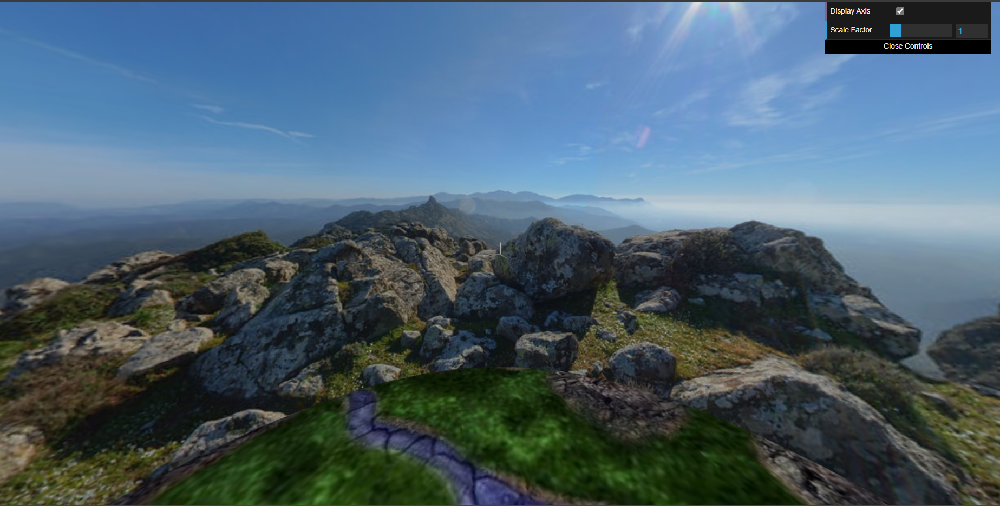

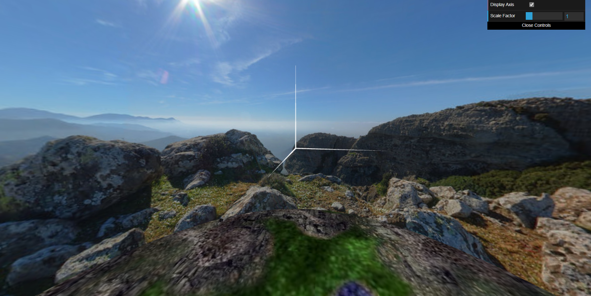

### Bird

* ~~ In the section 3.2 (Animação da Ave) where it says: "Coloque a Ave na cena a cerca de 3 unidades acima do chão", we choose not to do this for now, so you could see the bird clearly. If it was 3 units above the ground, the bird would be really far away from the camera.~~ *(this was a previous comment and has been corrected at the time of the final delivery, having changed the camera position to follow the bird)*

* We divided the bird creation in different components (head, each foot, each wing, and torso), making it easier to build the bird. 

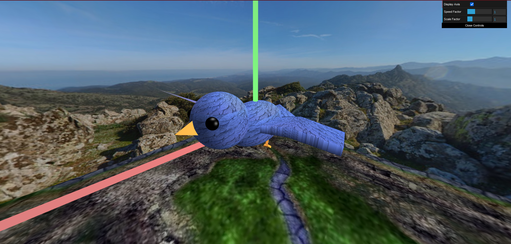

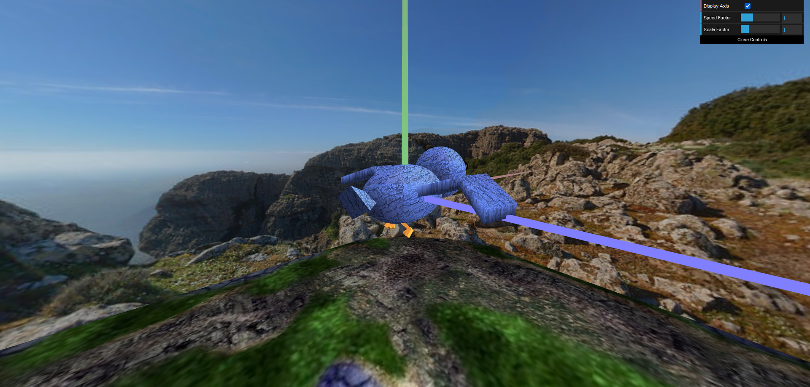

### Terrain

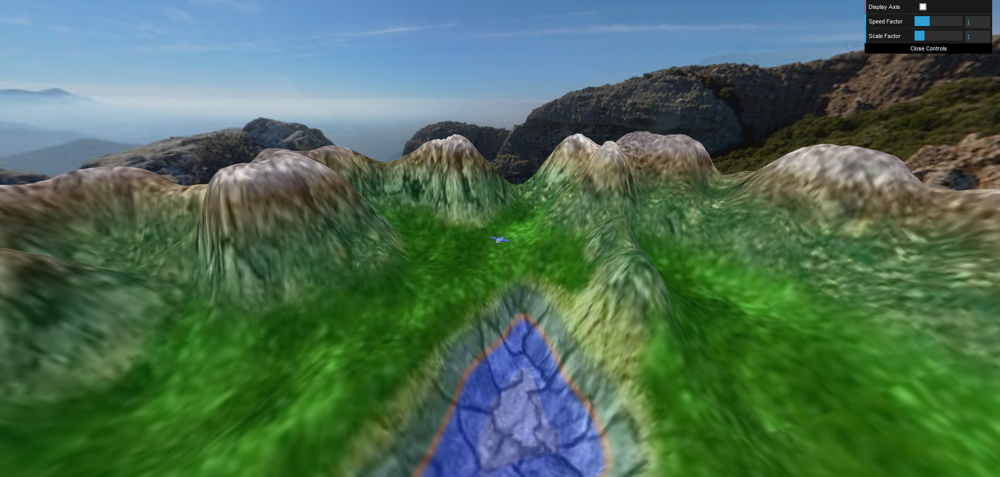

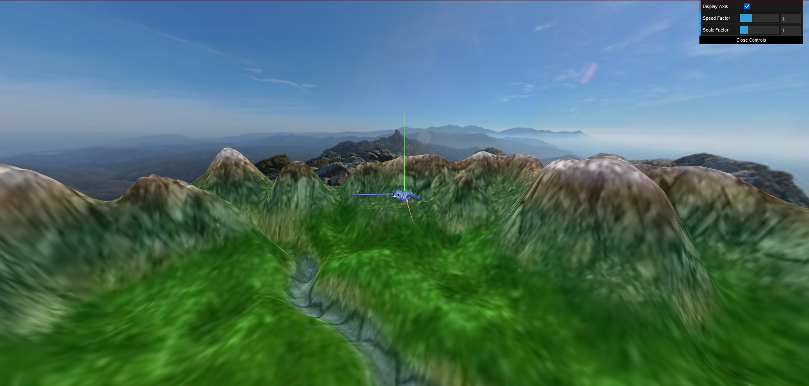

### Eggs and Nest

* Here you can see that we decided to implement a different view of the camera, rather than having the default one. The new view allows the user to see the scene in third person as the bird, moving with him.

* When dropping an egg, we chose to drop the egg to the ground when the bird is not withing reach of the nest. This way, if you fail to drop the egg in the nest, you have to pick it up to try again.

* When dropping an egg in the nest, rather than having fixed positions to where the eggs can fall into, we chose to randomize the position, so the code can be adapted to have more eggs on the scene.

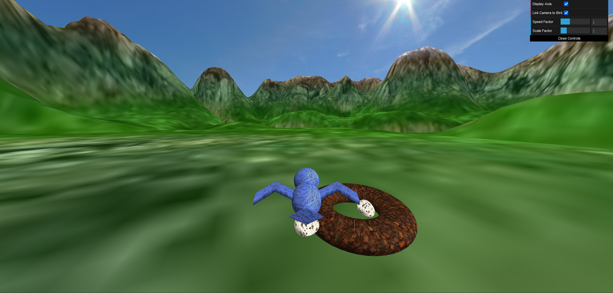

### Tree Billboard and Tree Patch

* We decided to create 3 tree group patches and 3 tree row patches, that we chose arbitrary positions for.

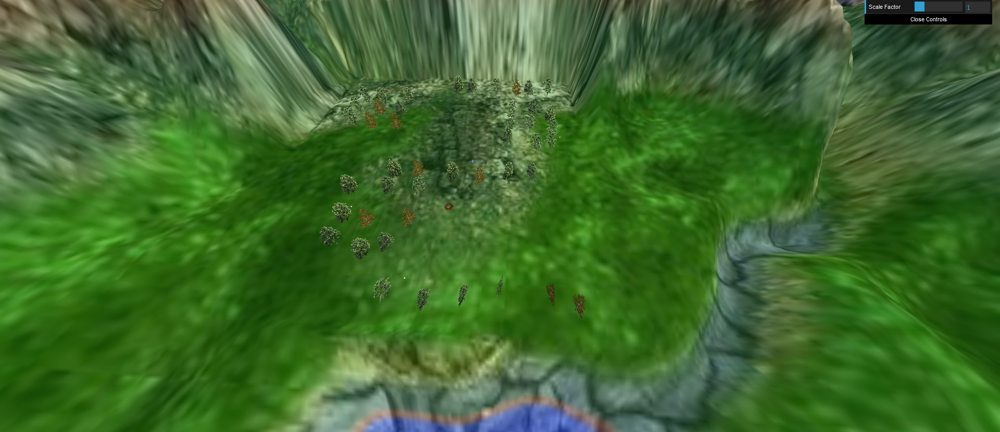

#### Tree Textures Credits

Here are the websites from where our group took the textures to use for the trees' billboards.

* Website for billboardtree2.png:
https://www.transparentpng.com/details/trees-photo_6386.html

* Website for billboardtree3.png:
https://www.gratispng.com/png-xm2rfv/

* Website for billboardtree4.png:
https://pngimg.com/image/92741

### Additional Feature

* We chose to develop the following option:
"Egg parabola trajectory when it's dropped by the bird to be deposited in the nest"

* Additionally, the egg behaves like a free fall object, keeping the bird's velocity as its initial velocity. The fall movement takes in consideration the gravity acceleration, and has an initial impulse to send the egg a little upwards before descending.

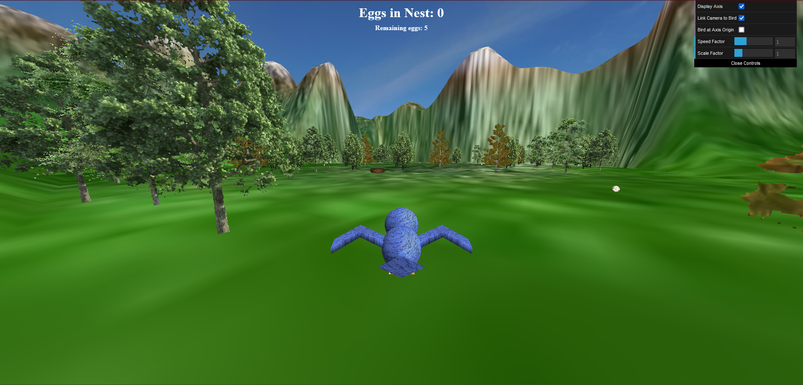

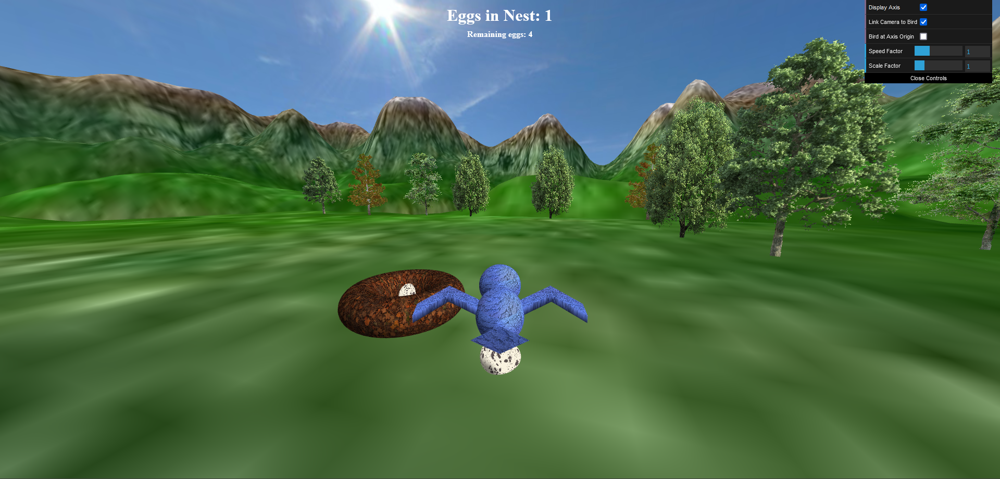

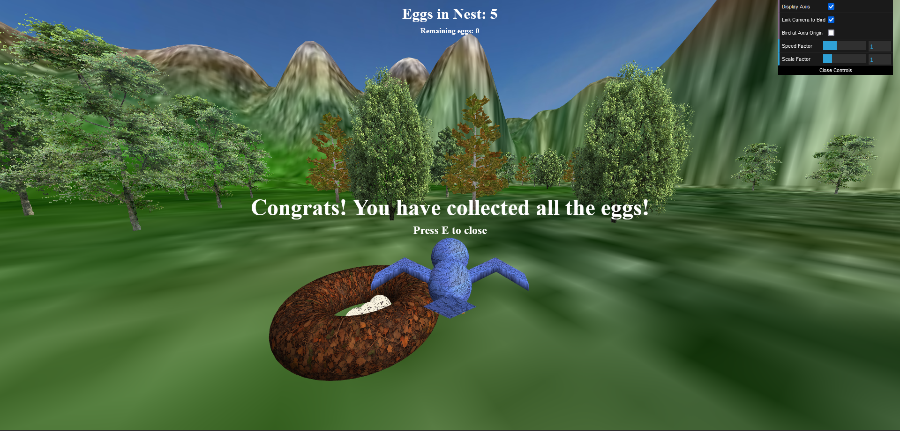

## Final Remarks

* As an additional feature, we chose to add to the interface a count of the eggs in the nest and the remaining eggs, so the app has a more game-like feeling. Also, there is a "congratulations screen" if the user catches all the eggs.

* Like explained previously in the section [Eggs and Nest](#eggs-and-nest), we decided to implement a different camera view. The new camera view works like a third person camera, following the bird. This feature can be disabled by unchecking the "Link Camera to Bird" checkbox in the interface.1a

* Furthermore, there is an additional checkbox to complement the previous feature, that being the "Bird at Axis Origin" checkbox. This checkbox allows the user to send the bird to the center of the scene, the origin of the axis. This is useful when unliking the camera to the bird, so you can see the bird at the origin of the scene and having the camera there, free to move around, like the default camera specifications.