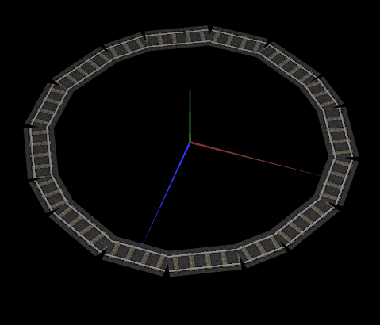
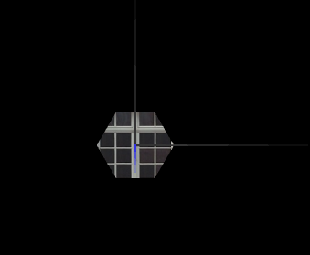
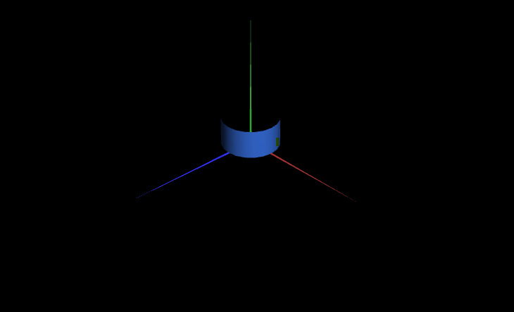
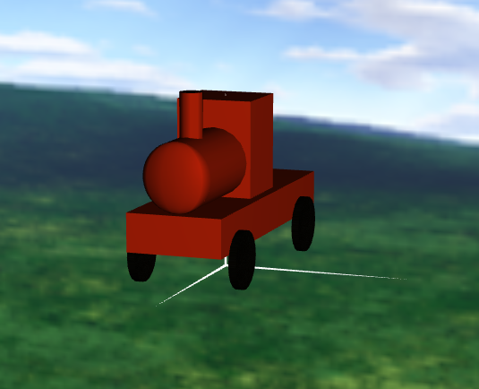
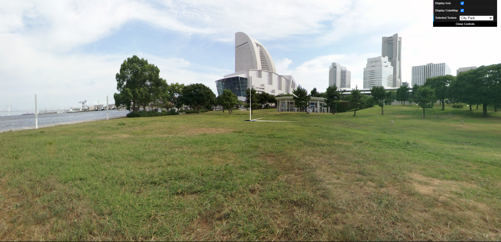
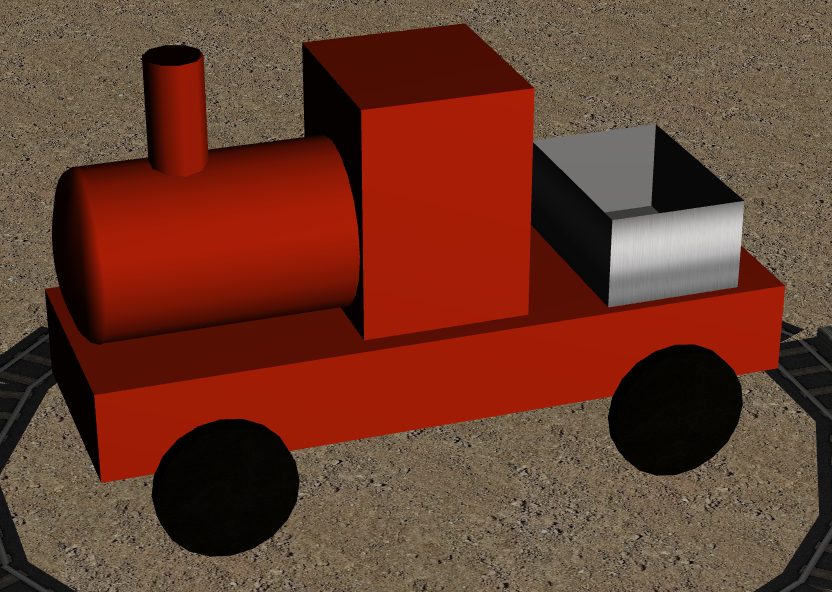
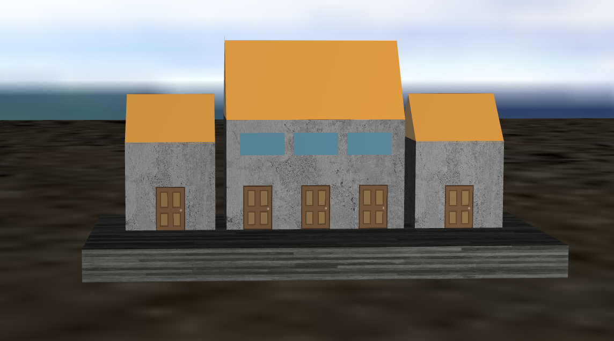
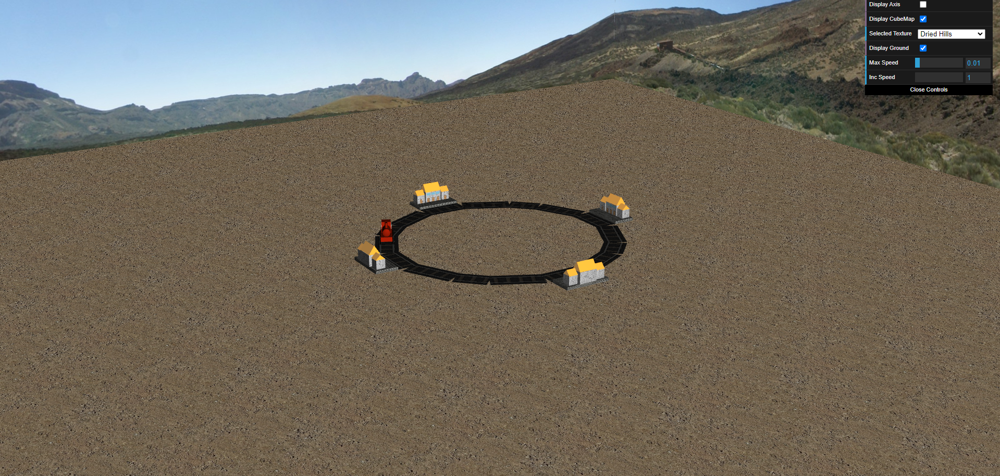

# CGRA 2021/2022

## Group T09xG05

| Name             | Number    | E-Mail             |
| ---------------- | --------- | ------------------ |
| Miguel Ramos dos Santos Gonçalves        | 201905873 | up201905873@up.pt |
| Pedro Manuel Bernardo Azevedo         | 201905966 | up201905966@up.pt  |

----
## Project Notes

-----
-Ponto 1
- Na screenshot 1 podemos ver o Track, em segmentos.
-----

-----

-Ponto 2
- Na screenshot 2 podemos o circulo com texturas, este circulo é so formado por 6 lados.
- Na screenshot 3 podemos o Cilindro com texturas
- Falta as texturas para a esfera (screenshot 4 em falta)
-----

-----

-Ponto 3
- Na screenshot 6 podemos o MyCubeMap com as texturas aplicadas em todas as faces. O GUI permite selecionar diversos ambientes.
-----

-----
-Ponto 4
- No ponto 4 foi completo o movimento e a variação da velocidade, incluindo duas variaveis (Max Speed, Inc Speed) para ajudar a contrular a velucidade.

-----
-Ponto 5
- Foi feito o obejto da Madeira.
- A crane e as suas funcionalidades ficaram por fazer.

-----
-Ponto 6
- Na screenshot 9 podemos ver que a caixa da madeira foi adicionada à locomotiva e o material aplicado tenta dar-lhe um aspeto metálico.
-----

-----
- Na screenshot 10 podemos observar a estação criada para a locomotiva.
-----

-----
- Na screenshot 11 podemos ver uma visão geral do trilho do comboio, com as estações todas ativas.
-----

-----
-Ponto 7
- Na screenshot 2 podemos o circulo com texturas, este circulo é so formado por 6 lados.
-----

